## Download & install Anaconda
* anaconda.org => Download Anaconda

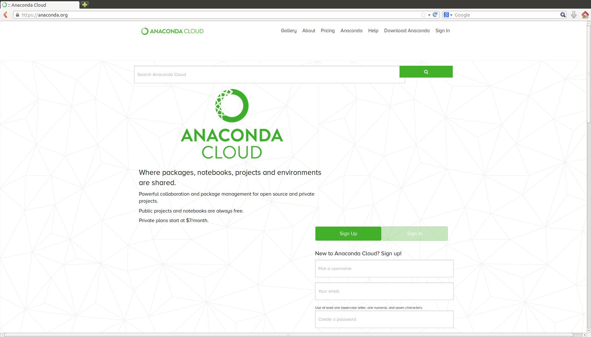

* Download the python 3.6 version. Normally "64-Bit(x86)Installer(551MB)" for ubuntu

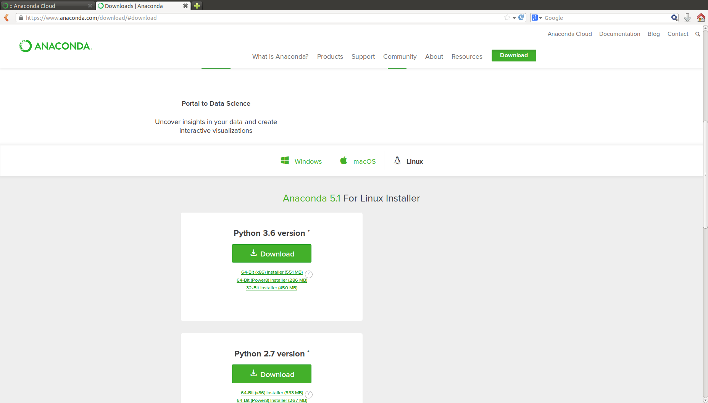

* Save file

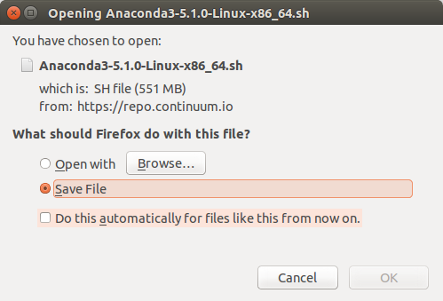

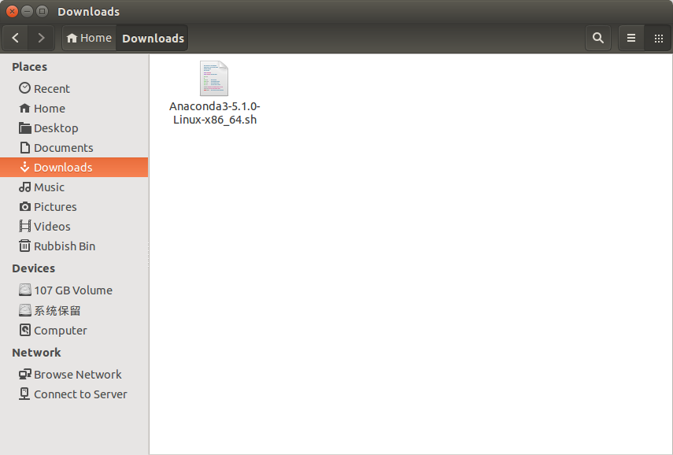

* Open the terminal and navigate to the folder where you store the file

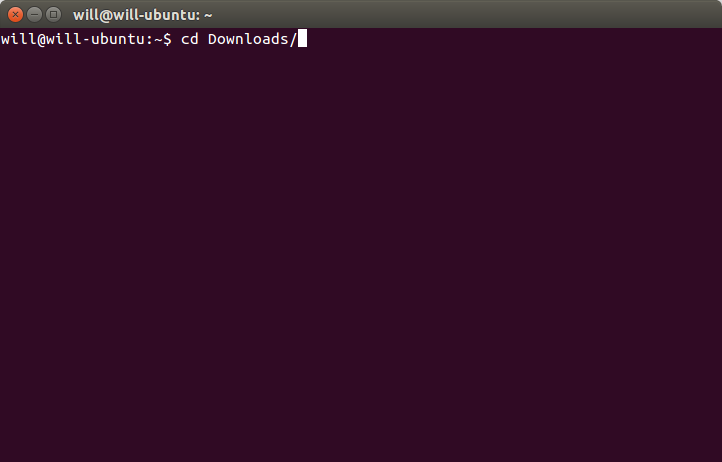

* run => bash file_name.sh
 ** ENTER

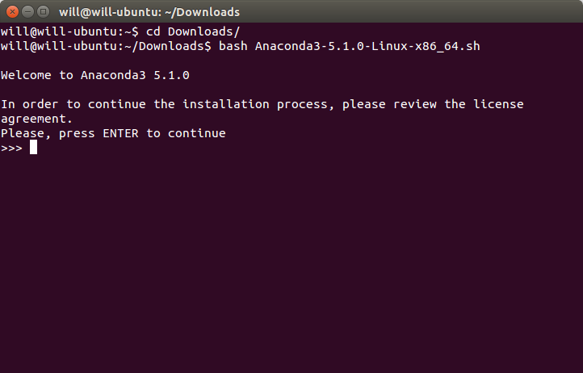
 
 ** ENTER (till the end of the license)

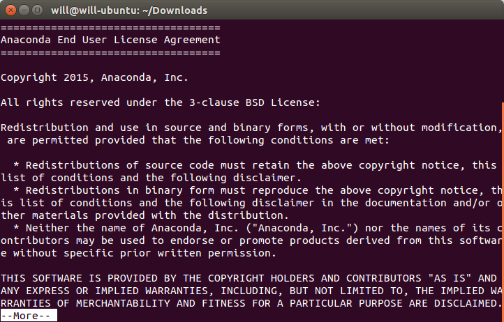

 ** yes then ENTER

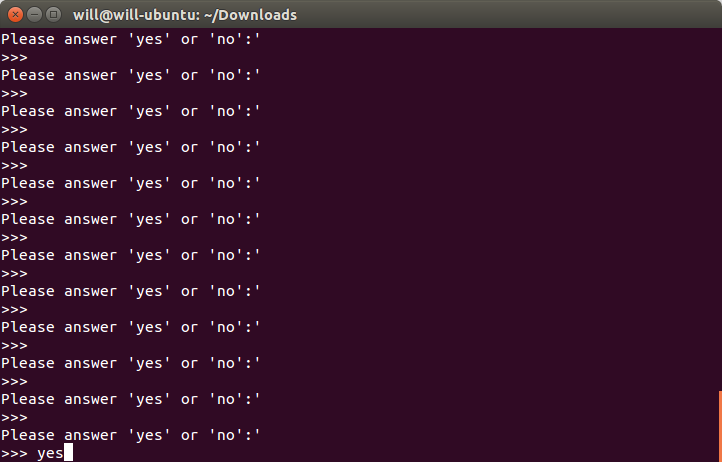
 
 ** ENTER

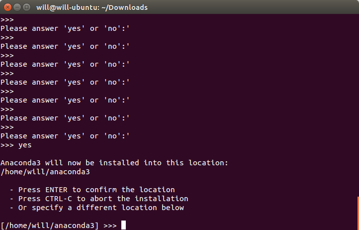
 
 ** yes then ENTER

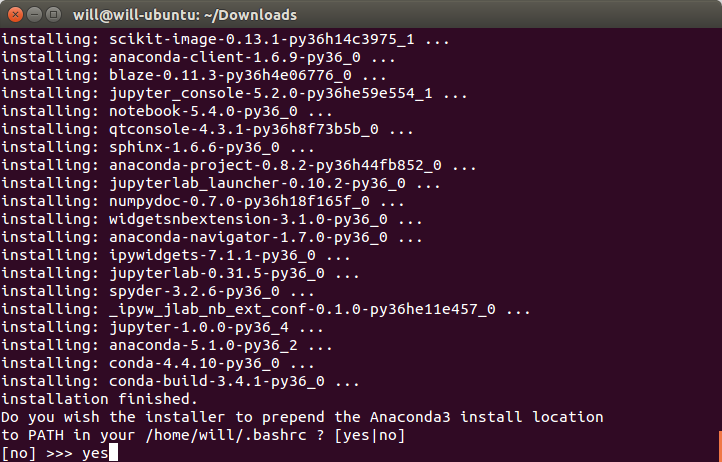
 
 ** either yes or no then ENTER

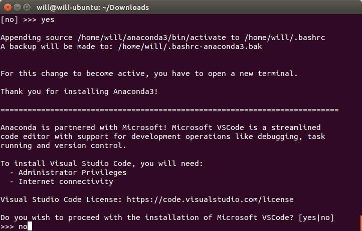

## Run anaconda-navigator
* open one terminal => anaconda-navigator

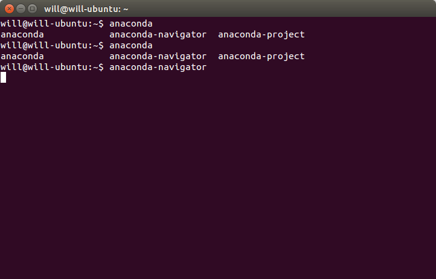

* you will have some choice of IDEs, I recommend you spyder.

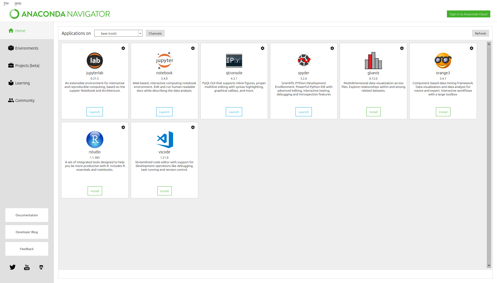

## Test: Run the disease_simulation of ass0
* open one terminal navigator to the folder where you store your code
 ** run => python3 disease_simulation.py --vis -s exercise4_maps/scenario1.scn

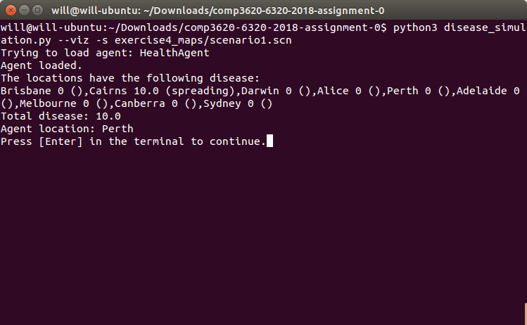

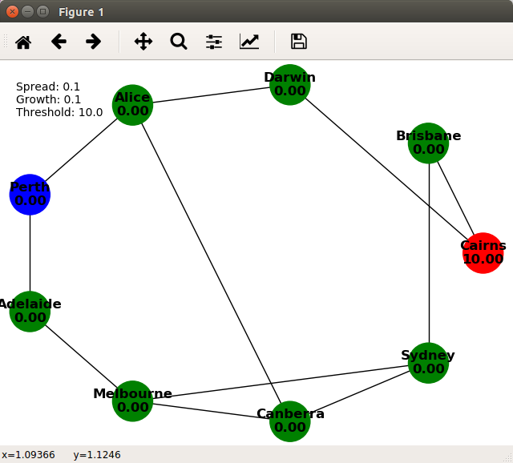